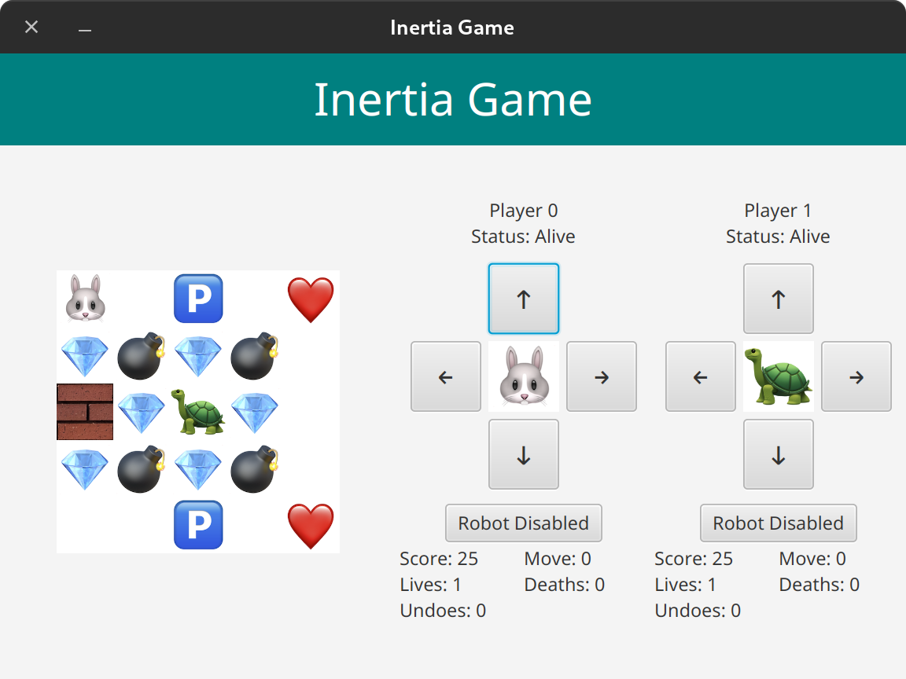

# COMP3021 PA3: Inertia Java FX Game - Multithreading Extension

In PA3, your task is to add the support of multithreading, multiple players and a robot strategy. 
The information provided in PA1 and PA2 will not be repeated in this README. 
You may check out [PA1](https://github.com/CastleLab/COMP3021-2021Fall-PA1-Student-Version) and [PA2](https://github.com/CastleLab/COMP3021-2021Fall-PA2-Student-Version) if you want to revisit that.

## Two Release Stages

Since parts of the framework in PA3 contains solutions of PA2, we release PA3 in two stages. At the first stage, we
will release parts of the PA3 framework, which does not involve GUI. Classmates can start working on PA3 using this
partial framework. We will release the full PA3 framework at the second stage right after PA2 deadline. Releasing
PA3 in two stages will enable classmates to start early on the PA3 as this assignment can be heavier than the 
other two assignments.

### Stage 1 - Core Extension (Released)

On **Nov. 1**, release:
- the specification of PA3 and
- the code skeleton for the core packages, i.e., `hk.ust.cse.comp3021.pa3.[controller|model|util]`.

There is no deadline for this stage. 
Your implementation should be submitted together with that of stage 2 by the deadline: **Nov. 30, 2021, 23:59**.

No code skeleton related to the TODOs in PA2 is released. 
So it will not interfere with PA2.

### Stage 2 - GUI Extension (Released)

On **Nov. 9**, release:
- the code skeleton for the rest of packages related to GUI, i.e., `hk.ust.cse.comp3021.pa3.view`.

The submission deadline for both stages of PA3 is: **Nov. 30, 2021, 23:59**. 

## Quick Links

- [Specifications](#specifications-changes-in-multiplayer-extension)
- [Tasks](#tasks)
- [IntelliJ Run Configurations](#intellij-run-configurations)
- [Submission](#submission)
- [Grading Scheme](#grading-scheme)

## Specifications (Changes in Multiplayer Extension)

### Multiplayer

Different from PA1, multiple players are allowed in a game. 
Note that the number of players can be `>=1` (can be more than 2). 
This means the core packages of the game, i.e., `hk.ust.cse.comp3021.pa3.[controller|model|util]` should intrinsically **support any number of players (not just 2 players)**.

However, to keep the GUI implementation simple, we put a `soft restriction` on the GUI package, i.e. `hk.ust.cse.comp3021.pa3.view.panes.MainMenuPane`, that only allow at most 2 players to be loaded in GUI.
**Nevertheless, you should always assume the number players can be more than 2.** 

### Backward Compatibility 

In PA3, the multiplayer extension is designed to be compatible to the interface of PA1 as much as possible. 
That is to say, the existing public methods of classes are largely respected and kept unchanged.
While we are adding more overload methods to implement the game when there are more than one player. 

For instance, in PA3, there are two implementations of `GameController#processMove` method:
- `MoveResult processMove(Direction direction)`: the original one in PA1. It works when there is only one player and will throw an exception when there are multiple players.
- `MoveResult processMove(Direction direction, int playerId)`: the extended method for multiplayer mode.

The benefit of maintaining backward compatibility is that almost all tests from PA1 can be inherited in PA3 to help you check your implementation in the multiplayer extension.

### Changes in Models

- `GameState` class: 
  - Now a game state instance is associated with a player instance. That is to say, each player has its own corresponding `GameState` instance recording the statistics e.g., lives and gems, with regard to this player.
  - `player` field: represents the player instance that the current game state is associated with.
- `Player` class:
  - Now a player instance is associated with a game state instance recording the statistics related to this player, e.g., lives and gems.
  - `gameState` field: represents the game state for this player.
  - `id` field: a unique id to the player instance. Each instance will have a different id.
- `GameBoard` class:
  - `players` field: Now game board instance has a list of players, which can be of length 1, 2 or even more.

### Changes in Controllers

- `GameController` class:
  - `gameStates` field: Now game controller has a mapping from player id to the game state instance associated with that player. A helper method `GameState getGameState(int playerID)` is provided to get the game state of a player.

### Changes in Game Mechanics

- Game Map 
  - Now it is allowed to have multiple players (i.e., `P`) in a game map.
- Game Board and Movement:
  - When moving a player, all other players on the game board are considered as a `wall`, which means the player can not move pass other players.
  - Each `gem`s on the game board can only be collected by one player, which means a `gem` should be removed from game board when some player have collected it.
  - Each `extra life`s on the game board can only be collected by one player, which means a `extra life` should be removed from game board when some player have collected it.
  - Each `mine`s on game board can kill multiple players, which means a `mine` should not be removed when some player dies on it.
  - When a player dies, and it runs out of lives (i.e., `GameState#numLives == 0`), the player should be removed from the game board. 
  - Undo is not allowed when there are more than one player.
- Winning & Losing Conditions
  - A player loses and get kicked out of the game (i.e., removed from game board) when it dies and runs out of lives (i.e., `GameState#numLives == 0`). 
  - The winning condition remains the same, i.e., when all gems have been collected. It is possible that all players lose and no one wins.
  - Players with the highest score among all win when there are more than one player still alive when all gems have been collected. It is possible that multiple players win.

### Maps

In PA3, it is allowed to have multiply players (`P`) in a game map. 
We provide a sample multiplayer map in `puzzles/05-extra-live.multiplayer.game`.
You can load it into the program (after [Stage 2](#stage-2---gui-extension) is released), and try it out.

### Manual Control and Robot

In PA3, in addition to manually controlling players by clicking buttons, we introduce automated robots to control the players. 

As shown in the screenshot of the GUI program (available after [Stage 2](#stage-2---gui-extension) is released), each player has its own control buttons, as well as a `Robot Disable/Enabled` button. 
When `Robot` is enabled, all control buttons are disabled and the player is controlled by an instance of `hk.ust.cse.comp3021.pa3.util.Robot`.
The robot can be disabled at any time to revoke manual control.

In PA3 you will need to implement the methods that delegate the control to the robot, as well as those revoking the control.
The robot should start a new thread to make moves, and it is expected to make moves at some specific time interval. 
The time interval between moves made should be obtained by the `timeIntervalGenerator` field of `Robot` class.

### Robot Strategy

Robot moves player automatically, so it has a strategy to decide the next move of the player. 
The Robot instance is constructed with a `strategy` parameter, which can be `Smart` or `Random`.
In the `Robot` class, we've already implemented a `Random` strategy in method `makeMoveRandomly`, which is a simple but rational random strategy to make moves. 
The random robot will not move to a direction that will make the player die if there are other choices, but for other non-dying directions, the robot just randomly chooses one.
If there is no choice but only have one dying direction to move, the robot will still choose it.
If there is no valid direction, i.e. can neither die nor move, the robot do not perform a move.

You are also required to implement the `Smart` strategy in method `makeMoveSmartly`, which will be compared with `Random` strategy.
We will let a random robot and smart robot compete with each other on a `5x5` game board, and repeat several times (>10).
The smart robot is expected to win in most of the time (more than half).

### Multithreading

Each aforementioned robot is expected to run in a separate thread. 
As a result, there can be multiple threads **concurrently** moving players on the game board. 
A typical case is that when you enable robots to control all players on the game board.
The robots move players in separate threads and there is also a main thread of JavaFx that updates the GUI.
So you are expected to do thread synchronization and keep the game states consistent: 
- Each gem and extra life can only be collected by one player.
- Players do not move pass each other, e.g., `Wp...PW` should not end up in `WP...pW`.

In a more formal way, the requirement of thread synchronization is to: 
- make the concurrent processing of moves of different players **serializable**: two concurrent moves of different players must result in a state that can be achieved by sequential moves (i.e., move one and then move the other);
- avoid dead-lock, where there are multiple players and no one is able to move.

## Tasks

Complete all the TODOs in the entire project. 
A detailed description of each task is provided in the Javadoc above each method. 
In IntelliJ IDEA, go to `View > Tool Windows > TODO` to jump to each TODO in the project. 
You may replace the placeholder implementation in the methods marked as `TODO`.

### IntelliJ IDEA

When testing your own implementation, you may use the provided `Run App` Run Configuration.

### Code Style

Since this is a Java course, we expect you to write idiomatic Java with a good code style. As such, we employ the tool
[CheckStyle](https://checkstyle.sourceforge.io/) to help you check the style of your implemented code.

You may use the [CheckStyle Run Configuration](#intellij-run-configurations) to run CheckStyle on your code. The report will be generated in `app/build/reports/checkstyle`.

Note that a good code style is part of the grading scheme.

## IntelliJ Run Configurations

To help you with the different tasks offered by Gradle, we have bundled some run configurations for you in IntelliJ, so that you can just choose what you want to run.

- Run App: Runs the GUI application `hk.ust.cse.comp3021.pa3.Main`.
- Provided Test: Runs all provided tests. All the test cases in PA1 become provided tests of PA3.
- CheckStyle: Runs CheckStyle, which catches any suboptimal Java practices used in your implementation.
- Javadoc: Generates Java documentation in HTML format. The documentation will be outputted in `app/build/docs`.
- Clean: Cleans any build files generated by Gradle.
- JAR: Creates a JAR of your project.

Note that for testing, there is an option for Gradle and an option for JUnit. While usually we would use the Gradle version, a bug in IntelliJ causes the test panel to not show up when testing using Gradle. Therefore, we suggest using the JUnit version of the test configurations instead.

## Submission

You should submit a ZIP file containing the following:

- This Java project. Please keep the original file structure.
- A `github-url.txt` file containing the URL of your private repository. We will ask you to add the TAs' accounts as collaborators soon.

You need to submit your ZIP file to [CASS](https://cssystem.cse.ust.hk/UGuides/cass/index.html). The deadline for this assignment is **November 30, 2021, 23:59**.

## Grading Scheme

|  | **Percentage** | **Notes** |
| --- | --- | --- |
| Keep your GitHub repository private | 5% | You must keep your repository **private** at all times. |
| Commit at least 3 times in different days | 5% | You should commit three times during different days in your repository. |
| Code Style | 10% | You get 10% by default, and every 5 warnings from CheckStyle deducts 1%. |
| Provided Tests | 15% | `(# of passing tests / # of provided tests) * 15%` |
| Hidden Tests | 65% | `(# of passing tests / # of hidden tests) * 65%` |

### Plagiarism

We trust that you are familiar with HKUST's Honor Code. If not, refer to
[this page](https://course.cse.ust.hk/comp3021/#honorcode).

